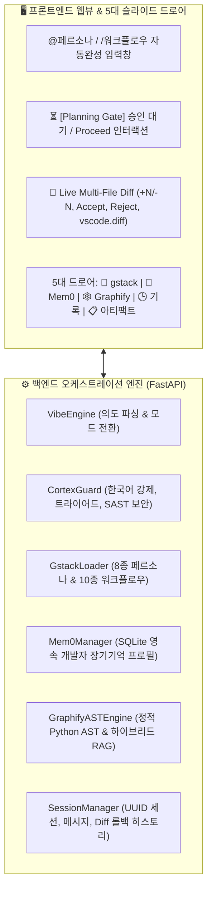

# 🚀 2026-08-19 Agent Smith IDE 프로젝트 종합 작업 보고서 및 PC 이관 핸드오버 (Handover Report)

본 문서는 오늘 진행된 **Agent Smith IDE**의 전체 아키텍처 구현 내역, 완료된 8대 핵심 기능, 아직 진행되지 않은 잔여 작업(Remaining Tasks), 그리고 **다른 PC에서 프로젝트를 클론받아 즉시 이어서 개발할 수 있는 완벽한 핸드오버(Handover) 가이드**를 정의합니다.

---

## 📋 1. 프로젝트 개요 및 현재 완성 상태

본 프로젝트는 VS Code 오픈소스 기반에 **Antigravity의 대화형 계획/승인 및 아티팩트 관리**, **Windsurf의 Live Multi-File Diff 및 롤백 제어**, **Cursor의 고속 인라인 코드 생성**, **Mem0 장기 기억 프로필**, **Graphify AST 지식 그래프 & 하이브리드 RAG**, 그리고 **CortexOS / gstack 전문가 페르소나 및 워크플로우 가드레일**을 통합한 차세대 엔터프라이즈 코딩 에이전트 IDE 플랫폼입니다.

* **완성된 핵심 마일스톤**: **Phase 1 (인프라 및 단일 인스톨러 배포) 100% 완료** + **Phase 2 (차세대 에이전틱 코딩 기능) 1번~8번 100% 구현 완료**
* **배포 바이너리**: [`dist/AgentSmith_Desktop_Setup_v1.0.0.exe`](file:///c:/dev/antigravity-workspace/aifullstack/agentsmith/dist/AgentSmith_Desktop_Setup_v1.0.0.exe) (157.58 MB, C# Native 단일 실행 설치 파일 컴파일 완료)

---

## 🛠️ 2. 오늘 완료된 8대 핵심 구현 내역 (Phase 2 1~8번)



| 번호 | 기능 구분 | 세부 구현 내용 | 연관 파일 |
| :--- | :--- | :--- | :--- |
| **1** | **Antigravity 스타일 아티팩트 관리** | 계획서/명세서 아티팩트 카드, 상단 `[📋 아티팩트]` 슬라이드 드로어, 에디터 열기(`vscode.openFile`) 연동 | `chat.html`, `chat.js`, `extension.js`, `vibe/engine.py` |
| **2** | **Planning Mode & 승인 게이트** | `🧠 Planning Mode` 전환, 계획 수립 후 대기하는 `⏳ [Planning Gate]`, `[✓ 승인하고 진행]` 클릭 시 자율 실행 루프로 자동 전환 | `chat.js`, `chat.css`, `vibe/engine.py` |
| **3** | **사고 과정 & 도구 호출 아코디언** | `🧠 사고 과정` 아코디언(⏱ 소요시간 뱃지), `🛠️ 도구 호출` 상세 로그, `🔄 자율 셀프코렉션(Self-Correction)` 블록 | `chat.js`, `chat.css`, `vibe/engine.py` |
| **4** | **Windsurf Live Multi-File Diff** | 다중 파일 변경 맵 시각화, `+N/-N` 통계, 파일별 `[✓ Accept]` / `[✕ Reject]`, `[🔍 Diff 비교]` (`vscode.diff`), `[↺ 전체 롤백]` | `chat.js`, `extension.js`, `main.py` |
| **5** | **UUID 세션 & 히스토리 DB** | `.agentsmith/sessions.db` SQLite 영속화 (`sessions`, `messages`, `artifacts`, `diff_history`), 상단 `[🕒 기록]` 드로어 1-Click 복원/삭제 | `db/session_manager.py`, `main.py`, `chat.js` |
| **6** | **Mem0 장기 기억 프로필** | `.agentsmith/mem0_memory.db` SQLite 기반 개발자 스타일/프로젝트 룰 영속화, 새 세션 시 시스템 프롬프트 자동 주입, `[🧠 기억]` 드로어 | `memory/mem0_manager.py`, `main.py`, `chat.html` |
| **7** | **Graphify AST 지식 그래프 & RAG** | Python AST 정적 파서 기반 Class/Function/Method 노드 및 Call Graph 추출, 하이브리드 RAG 연관 심볼 검색, `[🕸️ 그래프]` 드로어 | `graphify/ast_engine.py`, `main.py`, `chat.html` |
| **8** | **CortexOS & gstack 확장 체계** | 한국어 강제/UTF-8/트라이어드 가드레일, SAST 정적 보안 검사(`🛡️ SAST Security: PASSED`), 8대 페르소나/10대 워크플로우 `@`/`/` 실시간 자동완성 팝업, `[🧩 gstack]` 드로어 | `guardrails/cortex_guard.py`, `plugins/gstack_loader.py`, `chat.js` |
| **인프라** | **C# 단일 인스톨러 & 안정화** | 프로세스 락 자동 해제(`KillLockedProcesses`), 터미널 `conpty.node` 누락 해결, 사내 인증(OTP) 가드 모달 복원 및 표준 모드 지원 | `build_desktop_installer.py`, `package_desktop_dist.py` |

---

## ⏳ 3. 진행을 마무리 하지 못한 부분 및 잔여 로드맵 (Remaining Tasks)

다음 PC에서 이어서 진행할 잔여 작업 목록입니다 ([`coding-agent/TODO.md`](file:///c:/dev/antigravity-workspace/aifullstack/agentsmith/coding-agent/TODO.md) 참조):

### 📌 Phase 2 잔여 항목
1. **📌 9. 다중 모델(Multi-LLM) 오케스트레이터 & 로컬/온프레미스 Auto-Fallback**:
   - OpenAI (GPT-4o, o3-mini), Anthropic (Claude 3.5 Sonnet), Google (Gemini 2.0/1.5), DeepSeek (R1, V3) 클라우드 API 및 로컬 Ollama (`127.0.0.1:11434`), 사내 vLLM ServingRuntime 실시간 스위칭 구현.
   - API 장애 또는 Rate Limit 초과 시 무중단 자동 백업 모델 전환(Auto-Fallback) 가드레일 탑재.
2. **📌 10. Live FIM(Fill-In-The-Middle) 실시간 인라인 코드 자동완성**:
   - 에디터 내 타이핑 중 `Cursor/Copilot` 스타일 회색 고스트 텍스트(Ghost Text) 제안 렌더러 탑재.
   - `Tab` 키로 전체 수락, `Ctrl+→`로 단어별 부분 수락, `Esc` 거절 인터랙션 구현.

### 📌 Phase 3~5 후속 마일스톤
* **Phase 3**: 구글 클라우드(GCP) Vertex AI & GKE 이식 및 브랜치 CI/CD 파이프라인
* **Phase 4**: 온프레미스(Red Hat OpenShift AI + NVIDIA NIM GPU) 1-Click 배포 자동화
* **Phase 5**: 행사 시연용 관람객 실시간 Vibe 코딩 및 FIM 샘플 시나리오 패키징

---

## 💻 4. 다른 PC에서의 빠른 실행 및 셋업 가이드 (Quick Start Handover)

새로운 PC에서 작업을 이어받을 때 다음 절차를 순서대로 실행하세요:

### 1단계: Git 저장소 클론 및 브랜치 전환
```bash
git clone <저장소_URL>
cd agentsmith
git checkout feature/setup-git-guardrails
```

### 2단계: Python 가상환경 (`.venv`) 셋업
```powershell
# uv가 설치되어 있지 않은 경우
powershell -ExecutionPolicy ByPass -c "irm https://astral.sh/uv/install.ps1 | iex"

# 가상환경 생성 및 의존성 패키지 설치
uv venv .venv
.\.venv\Scripts\activate
uv pip install fastapi uvicorn pydantic pytest requests
```

### 3단계: 로컬 개발 서버 구동 및 웹뷰 테스트
```powershell
# 개발 런처 실행 (또는 FastAPI 단독 구동)
.\run_agent_smith_dev.bat

# 브라우저에서 프론트엔드 직접 테스트
# URL: http://127.0.0.1:5000/chat
```

### 4단계: 데스크톱 배포 패키지 및 C# 단일 인스톨러 컴파일
```powershell
# 1. 배포 패키지 번들링
.\.venv\Scripts\python.exe scripts\package_desktop_dist.py

# 2. C# Native 단일 실행 설치 파일 빌드
.\.venv\Scripts\python.exe scripts\build_desktop_installer.py

# 빌드 결과물: dist/AgentSmith_Desktop_Setup_v1.0.0.exe
```

---

## 📂 5. 오늘 작성된 작업 트라이어드 상세명세서 색인 (Specs Index)

| 작성일자 | 명세서 파일명 | 문서 링크 |
| :--- | :--- | :--- |
| 2026-08-19 | CortexOS 가드레일, gstack 전문가 페르소나 및 자동완성 시스템 상세명세서 | [`2026-08-19_cortex_and_gstack_guardrails_spec.md`](file:///c:/dev/antigravity-workspace/aifullstack/agentsmith/coding-agent/docs/specs/2026-08-19_cortex_and_gstack_guardrails_spec.md) |
| 2026-08-19 | Mem0 장기 기억 프로필 & Graphify AST 지식 그래프 구축 상세명세서 | [`2026-08-19_mem0_and_graphify_ast_rag_spec.md`](file:///c:/dev/antigravity-workspace/aifullstack/agentsmith/coding-agent/docs/specs/2026-08-19_mem0_and_graphify_ast_rag_spec.md) |
| 2026-08-19 | Live Multi-File Diff 및 UUID 멀티테넌트 세션 DB 구축 상세명세서 | [`2026-08-19_multi_file_diff_and_sessions_db_spec.md`](file:///c:/dev/antigravity-workspace/aifullstack/agentsmith/coding-agent/docs/specs/2026-08-19_multi_file_diff_and_sessions_db_spec.md) |
| 2026-08-19 | Planning Mode 승인 게이트, 사고과정/도구호출 아코디언 및 conpty 터미널 복구 상세명세서 | [`2026-08-19_planning_gate_and_thinking_accordion_spec.md`](file:///c:/dev/antigravity-workspace/aifullstack/agentsmith/coding-agent/docs/specs/2026-08-19_planning_gate_and_thinking_accordion_spec.md) |
| 2026-08-19 | 인스톨러 파일 잠금 자동 해결 상세명세서 | [`2026-08-19_installer_file_lock_fix_spec.md`](file:///c:/dev/antigravity-workspace/aifullstack/agentsmith/coding-agent/docs/specs/2026-08-19_installer_file_lock_fix_spec.md) |
| 2026-08-19 | 아티팩트 관리 및 인터랙티브 뷰어 엔진 구현 상세명세서 | [`2026-08-19_artifact_engine_and_viewer_implementation_spec.md`](file:///c:/dev/antigravity-workspace/aifullstack/agentsmith/coding-agent/docs/specs/2026-08-19_artifact_engine_and_viewer_implementation_spec.md) |
| 2026-08-19 | 표준 접근성 복원 및 선택적 사내 보안 인증 상세명세서 | [`2026-08-19_restore_standard_access_and_optional_enterprise_auth_spec.md`](file:///c:/dev/antigravity-workspace/aifullstack/agentsmith/coding-agent/docs/specs/2026-08-19_restore_standard_access_and_optional_enterprise_auth_spec.md) |
| 2026-08-19 | 전체 작업 워크스루 및 스크린샷 갤러리 | [`walkthrough.md`](file:///C:/Users/MZC01-SUNKIM317/.gemini/antigravity-ide/brain/51d9f65e-9d28-4832-b513-2fcef7e7a613/walkthrough.md) |
